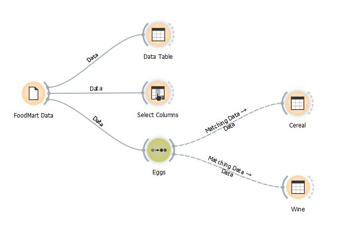
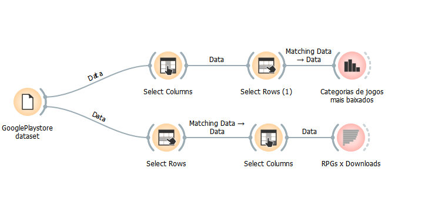
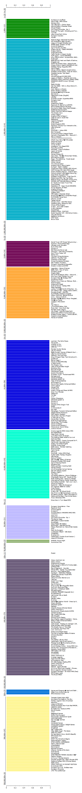
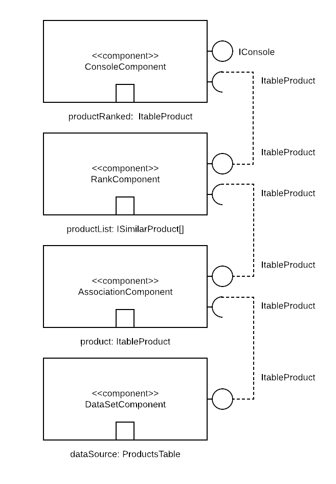
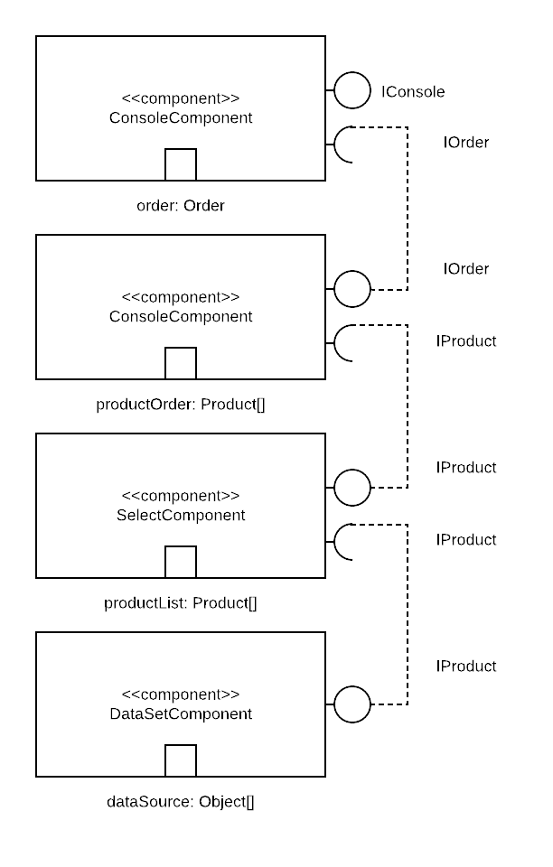
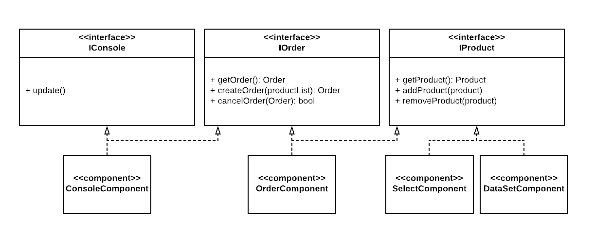

# lab01
## Nicholas Borba

Esse repositório contém as atividades:

- Foodmart
- Google Play Store
- Composição para Recomendação
- Composição de Pedido

## Imagem do Projeto

# Projeto Orange / Análise de Dados do Google PlayStore

## Imagem do Projeto

## Gráfico(s) de Análise

----

# Projeto de Composição de Componentes para Recomendação

# Projeto de Composição de Componentes para Pedido

## Diagrama de Componentes

## Diagrama de Interfaces

