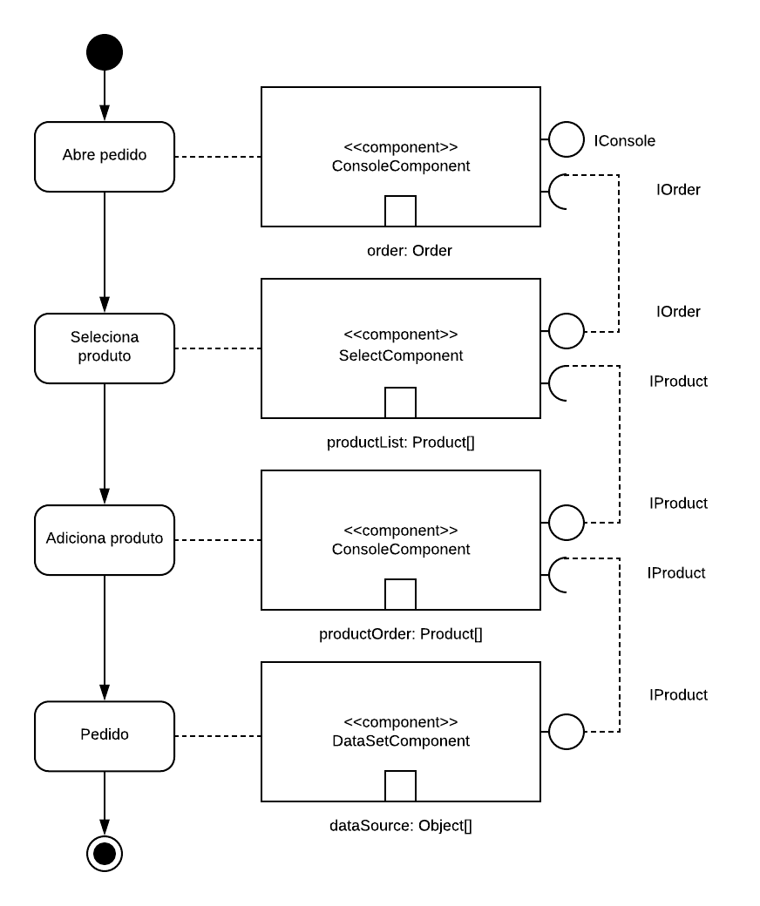

# Lab 03
## Aluno: Nicholas Borba

# Modelo para Apresentação do Lab03 - Model-View-Controller
* [Tarefa 1 - Diagrama Pedido]()
* [Tarefa 2 - Diagrama Leilão]()
* [Tarefa 3 - MIT App Inventor]() 

## Tarefa 1 - Diagrama de Pedido

## Tarefa 2 - Diagrama do Leilão

[

## Tarefa 3 - MIT App Inevntor - MarketPlace

### Tela 1 - Nenhum produto selecionado.
### Tela 2 - Primeiro produto selecionado.
### Tela 3 - Segundo produto selecionado.
### Tela 4 - Compra de um dos produtos efetiva.
### Tela 5 - Diagrama de blocos do aplicativo.
