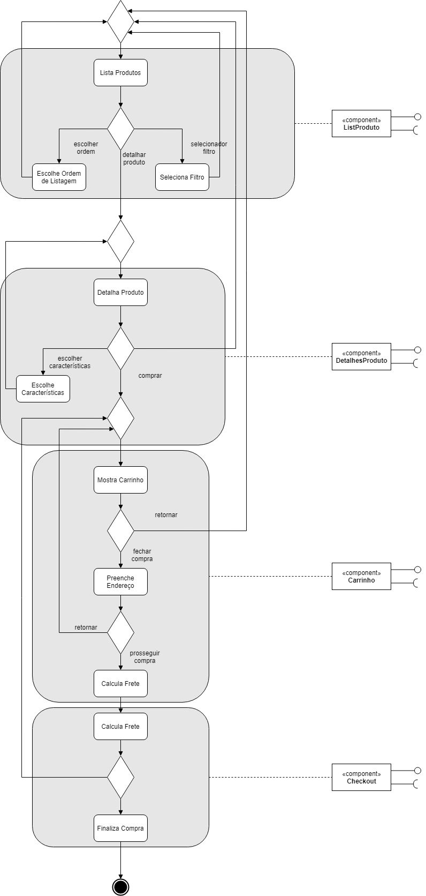
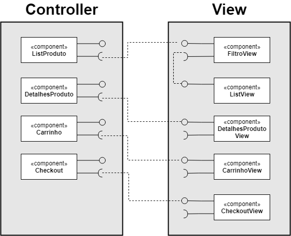
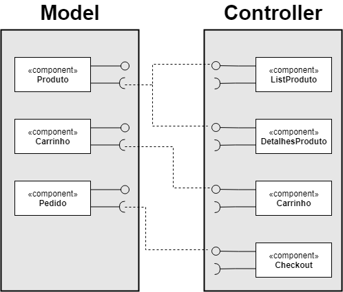

# Laboratório 04
## Aluno: Nicholas Borba

# Tarefa 1

# Tarefa 2

# Tarefa 3

# Tarefa 4

## API 01 - Google Books

API da Google para busca de informações sobre livros, podendo-se utilizar como parametros, o nome do livro, código ISBN, e até ordenar a busca por parametros como relevancia ou mais recente. 

Na consulta abaixo, solicito os volumes lançados do livro de código *0747532699*, que corresponde ao livro Harry Potter e a Pedra Filosofal.

URL DA REQUISIÇÂO: https://www.googleapis.com/books/v1/volumes?q=isbn:0747532699

- Chamada HTML

~~~ HTML
Request URL: https://www.googleapis.com/books/v1/volumes?q=isbn:0747532699
Request Method: GET
Status Code: 200 OK
Remote Address: [2800:3f0:4001:805::200a]:443
Referrer Policy: no-referrer-when-downgrade
~~~

- Response Header

~~~ HTML
HTTP/1.1 200 OK
Content-Type: application/json; charset=UTF-8
Vary: Origin
Vary: X-Origin
Vary: Referer
Content-Encoding: gzip
Date: Wed, 02 Sep 2020 01:56:44 GMT
Server: ESF
Cache-Control: private
X-XSS-Protection: 0
X-Frame-Options: SAMEORIGIN
X-Content-Type-Options: nosniff
Alt-Svc: h3-29=":443"; ma=2592000, h3-27=":443"; ma=2592000, h3-T051=":443"; ma=2592000, h3-T050=":443"; ma=2592000, h3-Q050=":443"; ma=2592000, h3-Q046=":443"; ma=2592000, h3-Q043=":443"; ma=2592000
Transfer-Encoding: chunked
~~~

- Response Header 2

~~~ HTML
GET /books/v1/volumes?q=isbn:0747532699 HTTP/1.1
Host: www.googleapis.com
Connection: keep-alive
Cache-Control: max-age=0
Upgrade-Insecure-Requests: 1
User-Agent: Mozilla/5.0 (Windows NT 10.0; Win64; x64) AppleWebKit/537.36 (KHTML, like Gecko) Chrome/85.0.4183.83 Safari/537.36
Accept: text/html,application/xhtml+xml,application/xml;q=0.9,image/avif,image/webp,image/apng,*/*;q=0.8,application/signed-exchange;v=b3;q=0.9
X-Client-Data: CIS2yQEIorbJAQjBtskBCKmdygEIraHKAQiZtcoBCPXHygEI+MfKAQjnyMoBCOnIygEItMvKAQiV1soBCLzXygE=
Sec-Fetch-Site: cross-site
Sec-Fetch-Mode: navigate
Sec-Fetch-User: ?1
Sec-Fetch-Dest: document
Referer: https://shkspr.mobi/blog/2016/05/easy-apis-without-authentication/
Accept-Encoding: gzip, deflate, br
Accept-Language: en-US,en;q=0.9,pt-BR;q=0.8,pt;q=0.7
~~~

- Response
~~~ JSON
{
  "kind": "books#volumes",
  "totalItems": 2,
  "items": [
    {
      "kind": "books#volume",
      "id": "xYotngEACAAJ",
      "etag": "hE1xzooayM8",
      "selfLink": "https://www.googleapis.com/books/v1/volumes/xYotngEACAAJ",
      "volumeInfo": {
        "title": "Harry Potter and the Philosopher's Stone",
        "authors": [
          "J. K. Rowling"
        ],
        "publisher": "Bloomsbury Pub Limited",
        "publishedDate": "1997",
        "description": "Harry Potter is an ordinary boy who lives in a cupboard under the stairs at his Aunt Petunia and Uncle Vernon's house, which he thinks is normal for someone like him who's parents have been killed in a 'car crash'. He is bullied by them and his fat, spoilt cousin Dudley, and lives a very unremarkable life with only the odd hiccup (like his hair growing back overnight!) to cause him much to think about. That is until an owl turns up with a letter addressed to Harry and all hell breaks loose! He is literally rescued by a world where nothing is as it seems and magic lessons are the order of the day. Read and find out how Harry discovers his true heritage at Hogwarts School of Wizardry and Witchcraft, the reason behind his parents mysterious death, who is out to kill him, and how he uncovers the most amazing secret of all time, the fabled Philosopher's Stone! All this and muggles too. Now, what are they?",
        "industryIdentifiers": [
          {
            "type": "ISBN_10",
            "identifier": "0747532699"
          },
          {
            "type": "ISBN_13",
            "identifier": "9780747532699"
          }
        ],
        "readingModes": {
          "text": false,
          "image": false
        },
        "pageCount": 223,
        "printType": "BOOK",
        "categories": [
          "Juvenile Fiction"
        ],
        "averageRating": 4.5,
        "ratingsCount": 2,
        "maturityRating": "NOT_MATURE",
        "allowAnonLogging": false,
        "contentVersion": "preview-1.0.0",
        "imageLinks": {
          "smallThumbnail": "http://books.google.com/books/content?id=xYotngEACAAJ&printsec=frontcover&img=1&zoom=5&source=gbs_api",
          "thumbnail": "http://books.google.com/books/content?id=xYotngEACAAJ&printsec=frontcover&img=1&zoom=1&source=gbs_api"
        },
        "language": "en",
        "previewLink": "http://books.google.com.br/books?id=xYotngEACAAJ&dq=isbn:0747532699&hl=&cd=1&source=gbs_api",
        "infoLink": "http://books.google.com.br/books?id=xYotngEACAAJ&dq=isbn:0747532699&hl=&source=gbs_api",
        "canonicalVolumeLink": "https://books.google.com/books/about/Harry_Potter_and_the_Philosopher_s_Stone.html?hl=&id=xYotngEACAAJ"
      },
      "saleInfo": {
        "country": "BR",
        "saleability": "NOT_FOR_SALE",
        "isEbook": false
      },
      "accessInfo": {
        "country": "BR",
        "viewability": "NO_PAGES",
        "embeddable": false,
        "publicDomain": false,
        "textToSpeechPermission": "ALLOWED",
        "epub": {
          "isAvailable": false
        },
        "pdf": {
          "isAvailable": false
        },
        "webReaderLink": "http://play.google.com/books/reader?id=xYotngEACAAJ&hl=&printsec=frontcover&source=gbs_api",
        "accessViewStatus": "NONE",
        "quoteSharingAllowed": false
      },
      "searchInfo": {
        "textSnippet": "Harry Potter is an ordinary boy who lives in a cupboard under the stairs at his Aunt Petunia and Uncle Vernon&#39;s house, which he thinks is normal for someone like him who&#39;s parents have been killed in a &#39;car crash&#39;."
      }
    },
    {
      "kind": "books#volume",
      "id": "yZ1APgAACAAJ",
      "etag": "KVmKUwsqVC8",
      "selfLink": "https://www.googleapis.com/books/v1/volumes/yZ1APgAACAAJ",
      "volumeInfo": {
        "title": "Harry Potter 1 and the Philosopher's Stone",
        "authors": [
          "J. K. Rowling"
        ],
        "publisher": "Bloomsbury Pub Limited",
        "publishedDate": "1997",
        "description": "Harry Potter is an ordinary boy who lives in a cupboard under the stairs at his Aunt Petunia and Uncle Vernon's house, which he thinks is normal for someone like him who's parents have been killed in a 'car crash'. He is bullied by them and his fat, spoilt cousin Dudley, and lives a very unremarkable life with only the odd hiccup (like his hair growing back overnight!) to cause him much to think about. That is until an owl turns up with a letter addressed to Harry and all hell breaks loose! He is literally rescued by a world where nothing is as it seems and magic lessons are the order of the day. Read and find out how Harry discovers his true heritage at Hogwarts School of Wizardry and Witchcraft, the reason behind his parents mysterious death, who is out to kill him, and how he uncovers the most amazing secret of all time, the fabled Philosopher's Stone! All this and muggles too. Now, what are they?",
        "industryIdentifiers": [
          {
            "type": "ISBN_10",
            "identifier": "0747532699"
          },
          {
            "type": "ISBN_13",
            "identifier": "9780747532699"
          }
        ],
        "readingModes": {
          "text": false,
          "image": false
        },
        "pageCount": 223,
        "printType": "BOOK",
        "categories": [
          "Juvenile Fiction"
        ],
        "averageRating": 4.5,
        "ratingsCount": 19,
        "maturityRating": "NOT_MATURE",
        "allowAnonLogging": false,
        "contentVersion": "preview-1.0.0",
        "panelizationSummary": {
          "containsEpubBubbles": false,
          "containsImageBubbles": false
        },
        "language": "en",
        "previewLink": "http://books.google.com.br/books?id=yZ1APgAACAAJ&dq=isbn:0747532699&hl=&cd=2&source=gbs_api",
        "infoLink": "http://books.google.com.br/books?id=yZ1APgAACAAJ&dq=isbn:0747532699&hl=&source=gbs_api",
        "canonicalVolumeLink": "https://books.google.com/books/about/Harry_Potter_1_and_the_Philosopher_s_Sto.html?hl=&id=yZ1APgAACAAJ"
      },
      "saleInfo": {
        "country": "BR",
        "saleability": "NOT_FOR_SALE",
        "isEbook": false
      },
      "accessInfo": {
        "country": "BR",
        "viewability": "NO_PAGES",
        "embeddable": false,
        "publicDomain": false,
        "textToSpeechPermission": "ALLOWED",
        "epub": {
          "isAvailable": false
        },
        "pdf": {
          "isAvailable": false
        },
        "webReaderLink": "http://play.google.com/books/reader?id=yZ1APgAACAAJ&hl=&printsec=frontcover&source=gbs_api",
        "accessViewStatus": "NONE",
        "quoteSharingAllowed": false
      },
      "searchInfo": {
        "textSnippet": "Harry Potter is an ordinary boy who lives in a cupboard under the stairs at his Aunt Petunia and Uncle Vernon&#39;s house, which he thinks is normal for someone like him who&#39;s parents have been killed in a &#39;car crash&#39;."
      }
    }
  ]
}
~~~

## API 02 - Air Quality

Essa API permite consultar a qualidade atual do ar em diversas partes do mundo todo, podendo filtrar por Pais, Regiao, Cidade, Coordenadas e permite ordenação, limite de resultados, e vários outros parametros. Os dados retornados dependem é claro das informações fornecidos pelos orgãos de pesquisa que as disponibilizaram, e uma informação em comum entre elas, são os níveis de tipos de particulas inaláveis (PM10, CO, O3...).

Na consulta abaixo peço para trazer os dados referentes a cidade de __*Campinas*__.

URL DA REQUISIÇÂO: https://api.openaq.org/v1/locations?city[]=campinas

- Header

~~~ HTML
Request URL: https://api.openaq.org/v1/locations?city[]=campinas
Request Method: GET
Status Code: 304 Not Modified
Remote Address: 99.84.22.86:443
Referrer Policy: no-referrer-when-downgrade
~~~

- Response Header 01

~~~ HTML
HTTP/1.1 200 OK
access-control-allow-credentials: true
access-control-allow-headers: Authorization, Content-Type, If-None-Match
access-control-allow-methods: GET, HEAD, POST, PUT, PATCH, DELETE, OPTIONS
access-control-allow-origin: *
access-control-expose-headers: WWW-Authenticate, Server-Authorization
access-control-max-age: 86400
Cache-Control: no-cache
Date: Wed, 02 Sep 2020 02:12:29 GMT
Last-Modified: Wed, 02 Sep 2020 00:16:14 GMT
Vary: origin
X-Cache: RefreshHit from cloudfront
Via: 1.1 1098361250300602dd04a7fa8d5120b3.cloudfront.net (CloudFront)
X-Amz-Cf-Pop: GIG51-C2
X-Amz-Cf-Id: eMk529F3JUCqxc4SfV85Kx9Xxa-dHWUuKC3X3s4AbK5WXFuin4uVvA==
Content-Type: application/json; charset=utf-8
Content-Encoding: gzip
Content-Length: 509
~~~

- Response Header 02

~~~ HTML
GET /v1/locations?city[]=campinas HTTP/1.1
Host: api.openaq.org
Connection: keep-alive
Cache-Control: max-age=0
Upgrade-Insecure-Requests: 1
User-Agent: Mozilla/5.0 (Windows NT 10.0; Win64; x64) AppleWebKit/537.36 (KHTML, like Gecko) Chrome/85.0.4183.83 Safari/537.36
Accept: text/html,application/xhtml+xml,application/xml;q=0.9,image/avif,image/webp,image/apng,*/*;q=0.8,application/signed-exchange;v=b3;q=0.9
Sec-Fetch-Site: none
Sec-Fetch-Mode: navigate
Sec-Fetch-User: ?1
Sec-Fetch-Dest: document
Accept-Encoding: gzip, deflate, br
Accept-Language: en-US,en;q=0.9,pt-BR;q=0.8,pt;q=0.7
If-Modified-Since: Wed, 02 Sep 2020 00:16:14 GMT
~~~

- Response

~~~ JSON
{
   "meta":{
      "name":"openaq-api",
      "license":"CC BY 4.0",
      "website":"https://docs.openaq.org/",
      "page":1,
      "limit":100,
      "found":3
   },
   "results":[
      {
         "id":"BR-13",
         "country":"BR",
         "city":"Campinas",
         "cities":[
            "Campinas"
         ],
         "location":"Campinas-Centro",
         "locations":[
            "Campinas-Centro"
         ],
         "sourceName":"Sao Paulo",
         "sourceNames":[
            "Sao Paulo"
         ],
         "sourceType":"government",
         "sourceTypes":[
            "government"
         ],
         "coordinates":{
            "longitude":-47.05721,
            "latitude":-22.90252
         },
         "firstUpdated":"2017-08-10T22:00:00.000Z",
         "lastUpdated":"2017-10-27T18:00:00.000Z",
         "parameters":[
            "co",
            "pm10"
         ],
         "countsByMeasurement":[
            {
               "parameter":"co",
               "count":1518
            },
            {
               "parameter":"pm10",
               "count":1599
            }
         ],
         "count":3117
      },
      {
         "id":"BR-18",
         "country":"BR",
         "city":"Campinas",
         "cities":[
            "Campinas"
         ],
         "location":"Campinas-Taquaral",
         "locations":[
            "Campinas-Taquaral"
         ],
         "sourceName":"Sao Paulo",
         "sourceNames":[
            "Sao Paulo"
         ],
         "sourceType":"government",
         "sourceTypes":[
            "government"
         ],
         "coordinates":{
            "longitude":-47.05897,
            "latitude":-22.87462
         },
         "firstUpdated":"2017-08-10T22:00:00.000Z",
         "lastUpdated":"2017-10-27T18:00:00.000Z",
         "parameters":[
            "no2",
            "o3",
            "pm10"
         ],
         "countsByMeasurement":[
            {
               "parameter":"no2",
               "count":1578
            },
            {
               "parameter":"o3",
               "count":1585
            },
            {
               "parameter":"pm10",
               "count":1656
            }
         ],
         "count":4819
      },
      {
         "id":"BR-32",
         "country":"BR",
         "city":"Campinas",
         "cities":[
            "Campinas"
         ],
         "location":"Campinas-V.União",
         "locations":[
            "Campinas-V.União"
         ],
         "sourceName":"Sao Paulo",
         "sourceNames":[
            "Sao Paulo"
         ],
         "sourceType":"government",
         "sourceTypes":[
            "government"
         ],
         "coordinates":{
            "longitude":-47.11928,
            "latitude":-22.94673
         },
         "firstUpdated":"2017-08-10T23:00:00.000Z",
         "lastUpdated":"2017-10-27T18:00:00.000Z",
         "parameters":[
            "co",
            "no2",
            "o3",
            "pm25"
         ],
         "countsByMeasurement":[
            {
               "parameter":"co",
               "count":1576
            },
            {
               "parameter":"no2",
               "count":1569
            },
            {
               "parameter":"o3",
               "count":1485
            },
            {
               "parameter":"pm25",
               "count":1646
            }
         ],
         "count":6276
      }
   ]
}
~~~