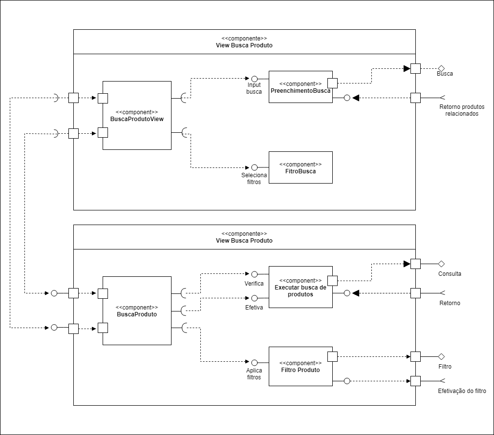

# Laboratório 04
> ## Aluno: Nicholas Borba

# Tarefa 1
> No link do Google Drive modelo ou no diretório resources/ você encontrará um modelo para resolver a tarefa: 
> - Escolha um conjunto de componentes do laboratório passado e os represente na forma de componentes com sub-comopnentes.

# Tarefa 2

> Crie uma conta no [Codepen](https://codepen.io/), copie o código do exemplo [React 03 - Componente Barra](https://codepen.io/santanche/pen/KKzmbwR) para a sua conta e construa um exemplo de componente adaptando o exemplo apresentado. Por se tratar de programação em JavaScript, podem ser feitas adaptações bastante simples.

> ## Solução 
> Na implementação abaixo, faço o consumo de uma API de nomes aleatórios e utilizo seu resultado para nomear o dinossauro(a).
> Link do código: https://codepen.io/nkborba/pen/vYGevQO

## HTML
~~~ HTML

~~~
## JS
~~~ JS
class Barra extends React.Component {
  render() {
    let resultado = "";
    for (let b = 1; b <= this.props.tamanho; b++)
      resultado += "=";
    return resultado;
  }
}

class RandomName extends React.Component {
  state = {
    loading: true,
    pessoa: null
  };
  
   async componentDidMount(){
     const url = "https://api.randomuser.me/?gender="+this.props.gender;
     const response = await fetch(url);
     const data = await response.json();
     this.setState({ pessoa: data.results[0], loading: false});
  }
  
  
  
  render() {
    const { pessoa } = this.state
    if (this.state.loading) {
      return "";
    }
    return (pessoa.name.title+" "+pessoa.name.first);
  }
}

const elemento = 

                   <h2>A(o) dinossaurx <RandomName gender="female"/></h2> 
                   <Barra tamanho="10"/>
                   <h2>pulou na lama.</h2>
                 
 
ReactDOM.render(elemento, 
        document.getElementById("root"));

const name = <RandomName gender="female"/>
~~~